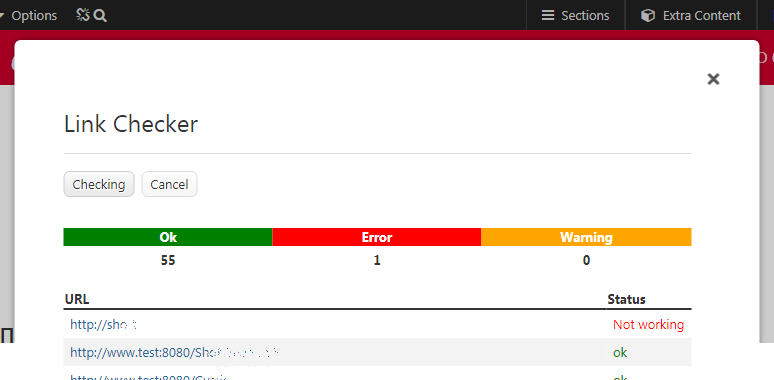

# [LinkChecker](https://github.com/mahotilo/LinkChecker) - Link Checker plugin for Typesetter CMS

## About
Check links and image sourses on the current page

- checking results are stored for one month
- sortable results table

## See also 
* [Typesetter Home](http://www.typesettercms.com)
* [Typesetter on GitHub](https://github.com/Typesetter/Typesetter)

## Requirements
* Typesetter CMS

## Manual Installation
1. Download the [master ZIP archive](https://github.com/mahotilo/LinkChecker-M/archive/master.zip)
2. Upload the extracted folder 'LinkChecker-M-master' to your server into the /addons directory
3. Install using Typesetter's Admin Toolbox &rarr; Plugins &rarr; Manage &rarr; Available &rarr; LinkChecker-M

## Demo
### Check report

## License
GPL 2, for bundled thirdparty components see the respective subdirectories.

Based on  https://github.com/jakeRPowell/linkChecker

## Version history
1.0
	- initial version
